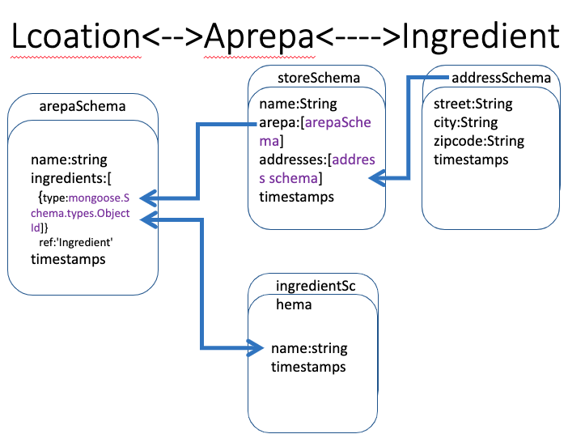

# PROJECT 2

Project 2 use Node.js, MongoDB, Express and EJS with Bootstrap framework to build out a full-stack web application. The website is to market and sell Arepas,primarily in the cuisines of Venezuela.

## Installation

No installation

## Link

<a href="https://jessie-project2.herokuapp.com/"> Tasty Arepas</a>

## Preview

  
  
  

## Technologies used
   
Frontend  
   <ul>
   <li>CSS<a href="https://getbootstrap.com/"> Bootstrap Framework</a>
   </li>
   <li><a href="https://www.npmjs.com/"> Pacakge Manager(NPM)</a>
   </li>
   <ul>
<li>express </li>
<li>mongoose </li>
<li>express-ejs-layouts </li>
<li>ejs method-override </li>
<li>dayjs</li>
<li>bcrypt</li>

</ul>
   </ul>
Backend 
   <ul>
   <li><a href="https://www.nodejs.org/"> Node.js</a></li>
   <li>RESTful Routes <ul>
   <li>Route methods<a href="https://expressjs.com/"> Express.js</a>
   <li>Route Testing<a href="https://www.postman.com/"> Postman</a></li></li></ul>
   <li>Database<a href="https://www.mongodb.com/"> MongoDB</a></li>
   <li>Data Modeling<a href="https://www.mongoose.com/"> Mongoose ODM</a></li>
   <ul>
      <li>Model/Schema</li>
      <li>MongoDB connection</li>
      <li>Authentication</li>
      <li>Authorization</li>
   </ul>
   <li>Embedded Javascript Template<a href="https://ejs.co/"> EJS</a> </li>
   <li>Version Control<a href="https://github.com/"> Github</a> </li>
   
   </ul>
   
DevOps 
   <ul>
   <li><a href="https://www.heroku.com/"> Heroku</a></li>
   </ul>

## Features

- Can be viewed across portable electroic devices

## User Stories
<ul>
<li>As an admin, I am able able to create a new arepa</li>
<li>As an admin, I am able able to add ingredients to a arepa</li>
<li>As an admin, I am able able to add a picture to a arepa</li>
<li>As an admin, I am able able to update arepa name to a exiting arepa</li>
<li>As an admin, I am able able to update picture to a exiting arepa</li>
<li>As an admin, I  amable able to remove ingredients to a arepa</li>
<li>As an admin, I am able able to remove a arepa</li>
<li>As an admin, I am able able to create a new store name </li>
<li>As an admin, I am able able to add new locations</li>
<li>As a user, I am able to see various arepas and store locations </li>
</ul>

## What's left?
 <ul>  
   <li>Required at least one checkbox checked for ingredient</li>
   <li>Dynamically update the home page</li>
   <li>Include log in functionality with encripted passwords </li>
   <li>Incorporate Google Map for store location </li>
</ul>

## Inspiration
<ul>

   <li><a href="https://infinite-shelf-28534.herokuapp.com/"> Civilized Coffee</a> Mark De May</li>
   <li><a href="https://codepen.io/peterbenoit/pen/jwyLrV"> Bootstrap Card Columns</a> Peter Benoit</li>

   <li><a href="https://youtu.be/1NrHkjlWVhM"> How To Build A Markdown Blog Using Node.js, Express, And MongoDB</a> Web Dev Simplified</li>

   <li><a href="https://youtu.be/BEoFSRdkSZQ"> Full Stack Developer Roadmap</a> Adrian Twarog</li>
   
</ul>

## Photo credits
<ul>
   <li><a href="https://upload.wikimedia.org/wikipedia/commons/e/e8/Arepa_de_pabellon.jpg"> Pabellon</a> </li>upload wikipedia</li>
   <li><a href="https://hungrysofia.files.wordpress.com/2011/03/img_9072_2.jpg"> Domino</a> </li>hungrysofia</li>
   <li><a href="https://arepasdelgringo.com/wp-content/uploads/2015/02/DSC_0384.jpg"> Rumbera</a> </li>Arepas del Gringo</li>
   <li><a href="https://www.wikichef.net/webapp/img/recipes/73f721_arepa-de-queso-blanco-arepero-o-de-mano-wc_w1000.jpg"> con Queso</a> </li>wikichef</li>
   <li><a href="https://thumbs.dreamstime.com/b/venezuelan-arepas-here-homemade-venezuelan-arepas-close-up-reina-pepiada-avocado-chicken-arepa-venezuelan-arepas-homemade-126181930.jpg"> Reina Pepiada</a> </li>Dreamstime</li>
   <li><a href="https://i1.wp.com/enrilemoine.com/wp-content/uploads/2016/08/2.-Tuna-Salad-Arepa-SAVOIR-FAIRE-by-enrilemoine.jpg?ssl=1"> Tuna</a> </li>website enrolemoine</li>
   <li><a href="https://www.theconstitutional.com/sites/drupal.theconstitutional.com/files/Liberty_Bell%20w%20ind%20hall%20horiz.jpg">Philadelphia</a> </li>The Constitutional</li>
   <li><a href="https://culturecrusaders.com/wp-content/uploads/2020/06/Six-best-things-to-do-in-Hollywood-FL-2.jpg">Oakland Park</a> </li>Culture Crusaders</li>
</ul>